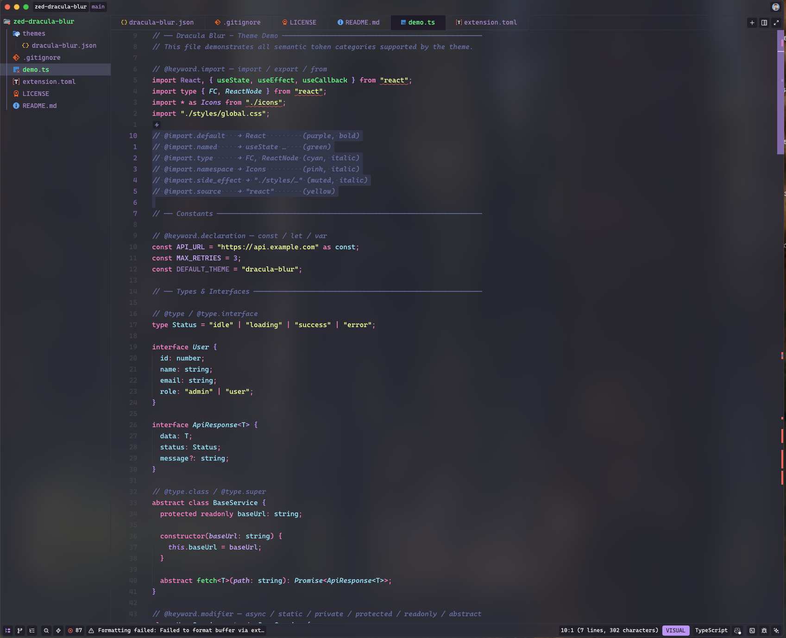
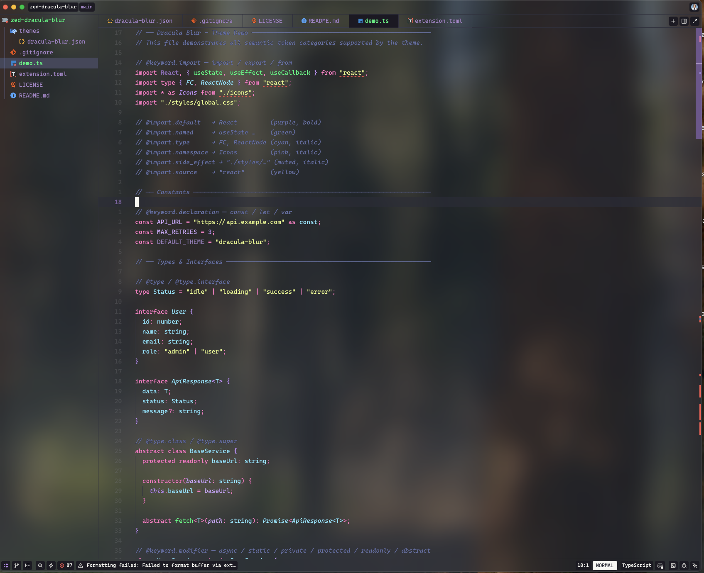
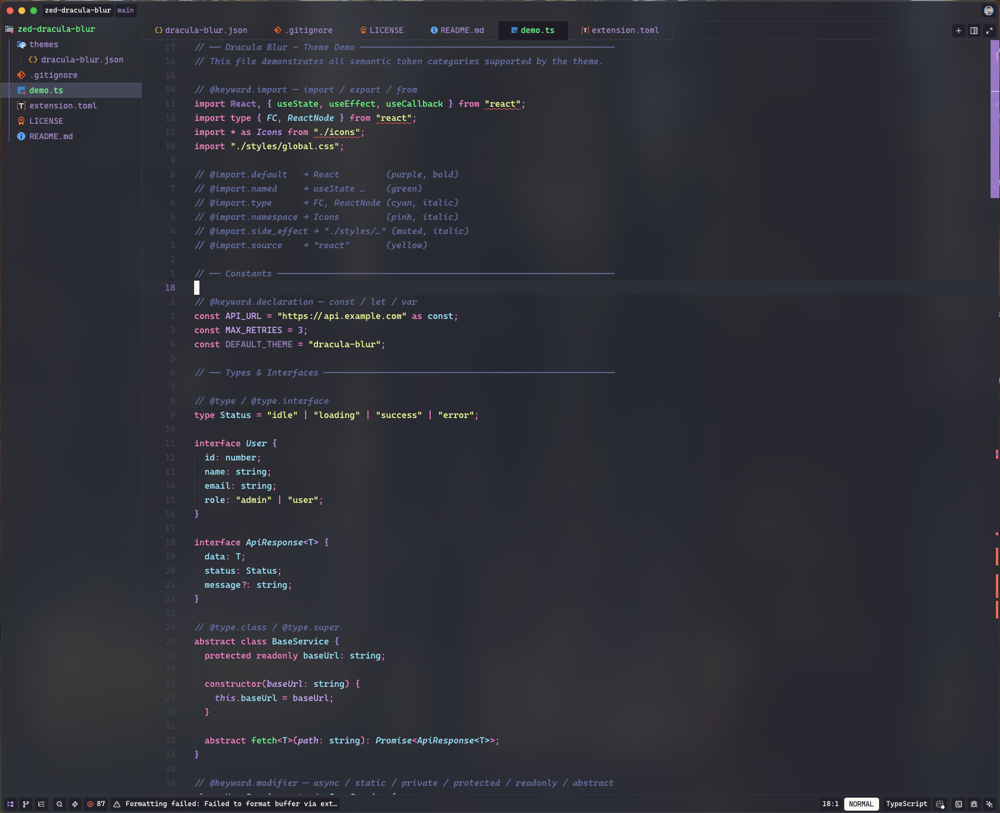

# Dracula Blur Themes

A Dracula-inspired theme for [Zed](https://zed.dev) with blur aesthetics and refined contrast.

## Previews

### Dracula Blur

### Dracula Blur [Light]

### Dracula Blur [Heavy]

## Variants

| Variant                | Opacity | Best For              |
| ---------------------- | ------- | --------------------- |
| `Dracula Blur [Light]` | ~60%    | Heavy compositor blur |
| `Dracula Blur`         | ~85%    | Recommended default   |
| `Dracula Blur [Heavy]` | ~88%    | Subtle or no blur     |

## Recommended Pairing

For the best experience, pair with **[Zed Highlight TypeScript](https://github.com/zeinosnsb/zed-highlight-typescript)** — this theme is designed to take full advantage of its granular semantic tokens.

## License

MIT
